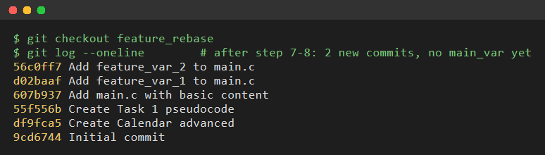
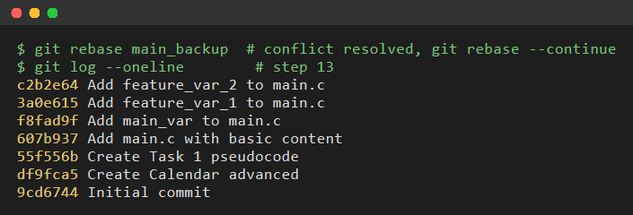
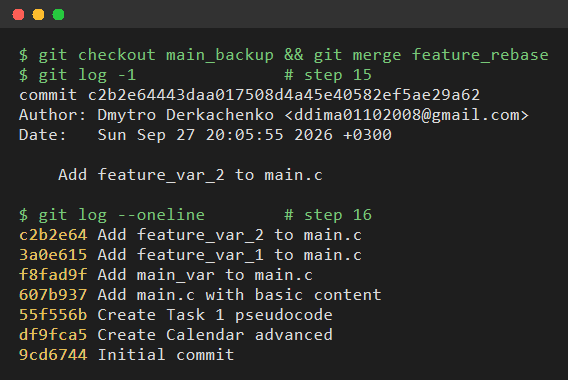
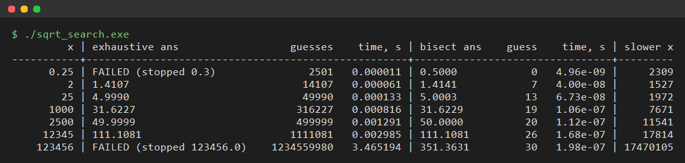

# Practical 4 — Git tips + square root search

## Task 1 — rebase / merge snapshots

Branch `feature_rebase` (with `main.c`) is pushed to `origin`.

| Snapshot | What it shows |
|---|---|
|  | `git log` on `feature_rebase` after steps 7–8: two feature commits, `main_var` commit is not there |
|  | after `git rebase main_backup` (conflict in `main.c` resolved, both lines kept): 3 commits — `main_var` + two feature commits on top |
|  | `main_backup` after `git merge feature_rebase` (fast-forward, because the branch was rebased first) |

## Task 2 — exhaustive search vs bisection

`sqrt_search.c`, epsilon = 0.01, exhaustive step = epsilon² = 0.0001.

```
gcc -std=c11 -Wall -Wextra -o sqrt_search sqrt_search.c -lm
./sqrt_search
```



Conclusions:

* Exhaustive search makes ~sqrt(x) / 0.0001 guesses (linear in sqrt(x)); bisection makes ~log2(x / epsilon) guesses (≤ 30 here).
* Bisection is ~10³–10⁴ times faster already for small x, and the gap grows with x.
* **Worst inputs for exhaustive search are large x where it fails**: near sqrt(x) one step changes ans² by 2·ans·0.0001, which exceeds epsilon once ans > 50 (x > 2500). Then it can jump over the answer and keeps going until ans > x — x / 0.0001 guesses. For x = 123456: 1.2·10⁹ guesses, ~3.5 s and still no answer, while bisection gives 351.3631 in 30 guesses (~0.2 µs) — ~10⁷ times faster.
* Exhaustive search also fails for 0 < x < 1 (e.g. 0.25): it stops at ans > x, but sqrt(x) > x there. Bisection handles it with `high = max(1, x)`.
